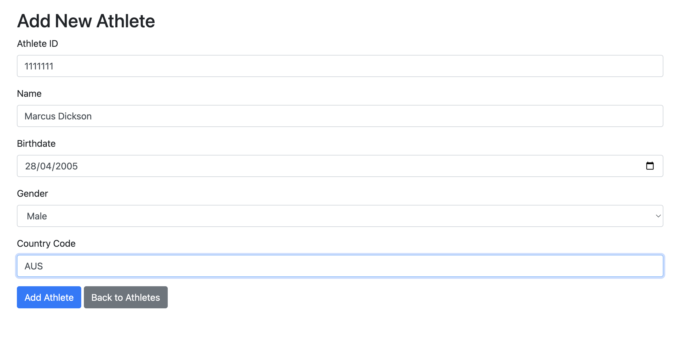
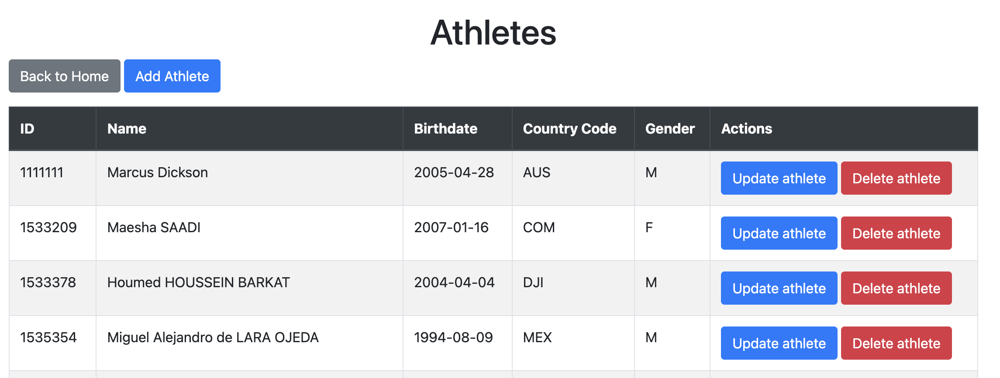
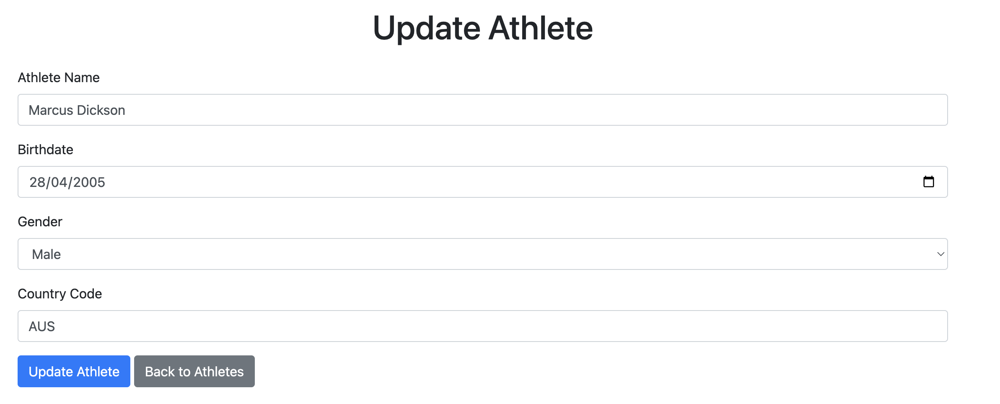
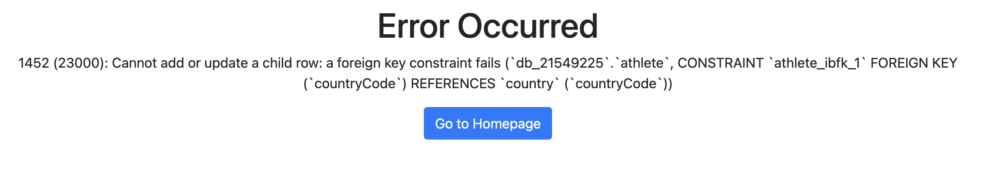
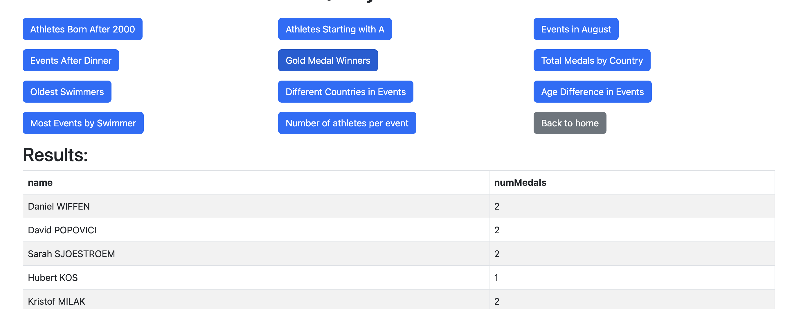

# SQL Olympics Server User Guide
## Introduction
The purpose of this document is to outline how to setup and run my implementation. The guide will cover:

- The specifications of the software I used, including (known) compatible software.
- Setting up the MySQL database.
- Setting up the Python environment.
- Running the web server

## Requirements
### Operating Systems
Any Unix-based system (SHOULD) work, but so far the code has been tested on:
- Ubuntu
- Mac OS 
### Software requirements
Install these requirements before following rest of the guide
- mySQL (Tested with version 14.14 for Mac)
- Python (Tested with version 3.12.4)

#### Automatically installed requirements
The following requirements are installed via `requirements.txt` when setting up the Python environment. These will be installed automatically, and don't need to be installed yet. 
- Flask (tested with v3.0.3)
- my-sql-connector (tested with v9.0.0)

## Step 1: Setting up MySQL
The first step is to `cd` into the sql section of the directory of my submission. Assuming you are already in the directory of my project, this should be as simple as running:
```
cd sql
```
### Creating dsuser
Next, assuming you have installed MySQL (and set up the root user via the installer), type the following command:
```
mysql -u root -p
```
And enter the password you used to setup the root user.

Then, enter the following commands:
```
CREATE USER 'dsuser'@'localhost' IDENTIFIED BY 'userCreateSQL';
GRANT ALL PRIVILEGES ON *.* TO 'dsuser'@'localhost' WITH GRANT OPTION;
FLUSH PRIVILEGES;
```
This will create a new account with the username `dsuser`, and password `userCreateSQL`. Then, it will provide root access to this user. Exit out of the database via `exit`, and type in the following command:
```
mysql --local_infile=1 -u dsuser -p
```
Login with the password `userCreateSQL`

### Setting up the database with local file-reading privileges
The next step is to setup the database and its required privileges.
Enter the following commands:

```
CREATE DATABASE db_21549225;
use db_21549225;
SET GLOBAL local_infile=1;
```
### Initialising the database
Run the following command to create the tables, load them with data, and create the stored procedures and views.
```
\. init_database.sql
```
You'll know this step is successful by looking at the number of rows inserted into the table. If the following server response matches your terminal output, your database is initialised successfully:
```
Query OK, 189 rows affected (0.01 sec)
Records: 189  Deleted: 0  Skipped: 0  Warnings: 0

Query OK, 1 row affected (0.00 sec)
Records: 1  Deleted: 0  Skipped: 0  Warnings: 0

Query OK, 1 row affected (0.00 sec)
Records: 1  Deleted: 0  Skipped: 0  Warnings: 0

Query OK, 690 rows affected (0.01 sec)
Records: 690  Deleted: 0  Skipped: 0  Warnings: 0

Query OK, 197 rows affected (0.00 sec)
Records: 197  Deleted: 0  Skipped: 0  Warnings: 0

Query OK, 57 rows affected, 56 warnings (0.00 sec)
Records: 57  Deleted: 0  Skipped: 0  Warnings: 56

Query OK, 1466 rows affected (0.02 sec)
Records: 1466  Deleted: 0  Skipped: 0  Warnings: 0
```
Now everything is ready for the web server.

### Interlude: running commands

My webserver does not include functionality for running all my queries at once, nor does it contain functionality for executing my stored procedures and views. Fortunately, each one of these has their own files to test, with their own commands.

To show all the queries at once:
```
\. queries.sql
```
To create all the stored procedures, and run a test command for each one:
```
\. procedures.sql
```
Finally, to create the views, and run a test command for each one:
```
\. views.sql
```

## Python
### Setting up the environment
Open another terminal window in the project directory.

It's usually a good idea to set up virtual environments for any Python project. Technically, this is optional, but I would strongly recommend running the following commands:
```
python -m venv venv
source venv/bin/activate
pip install -r requirements.txt
```
This will install the flask and my-sql-connector requirements mentioned previously.

### Running the website
Now the webserver is ready to run. Run these commands:
```
cd app
python3 app.py
```
You should be greeted with the following terminal window:
```
 * Serving Flask app 'app'
 * Debug mode: on
WARNING: This is a development server. Do not use it in a production deployment. Use a production WSGI server instead.
 * Running on http://127.0.0.1:5000
Press CTRL+C to quit
 * Restarting with stat
 * Debugger is active!
 * Debugger PIN: 243-796-850
```
If this is showing, the webserver is working as expected and you can finally use the web app!

## Web App
### Running the app

To actually open the web app, open the link your Flask server is running on. If you have the same output as above, it should be 
http://127.0.0.1:5000
### Features
Upon opening the page, you will be presented with two buttons for:
1. Athletes table, where you can add, delete and update athletes
2. Execute queries, where you can execute the 11 queries I created in my `queries.sql` files

It will look like this:


#### Athletes table
If the MySQL database is setup correctly, you'll see the following page:



Click 'Add athlete' and you'll see this form:


Feel free to add a new athlete, and you'll be redirected back to the Athletes table page.

If you wish to update your athlete:



Finally, if you want to delete your athlete, you'll be greeted with a popup asking to confirm whether you wish to delete the athlete. Upon confirming, the athlete will be deleted. This includes their entries in the CompetesIn table as well. To test this run the following command in the MySQL server:
```
SELECT * FROM CompetesIn WHERE athleteID LIKE '1533209';
```
And you will see the following:
```
+-----------+-------------+-------------+
| athleteID | eventID     | athleteRank |
+-----------+-------------+-------------+
| 1533209   | SWMW50MFRH2 | 1           |
+-----------+-------------+-------------+
```

Now, delete the entry for Maesha SAADI, and run the command again. This will be your output:
```
Empty set (0.00 sec)
```

#### Error page
If you add/update an athlete with an athleteID that already exists, or with a countryCode that is not in the Country table, you'll be re-directed to a page that looks like this:

Clicking the button will return you to the homepage.

#### Queries page
On the homepage, clicking on execute queries will bring you here:


Execute any one of the pre-defined queries in my `queries.sql` by clicking its respective button. The button will run the query and put the results in a table like so:

